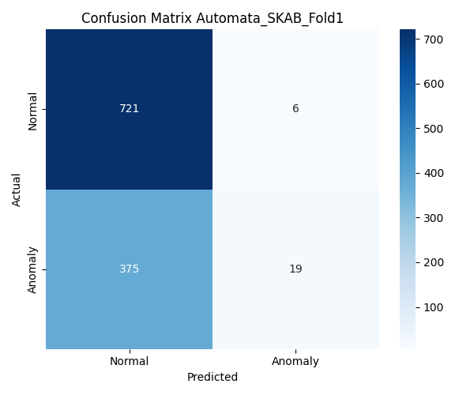
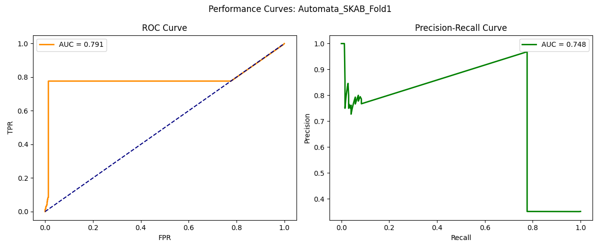
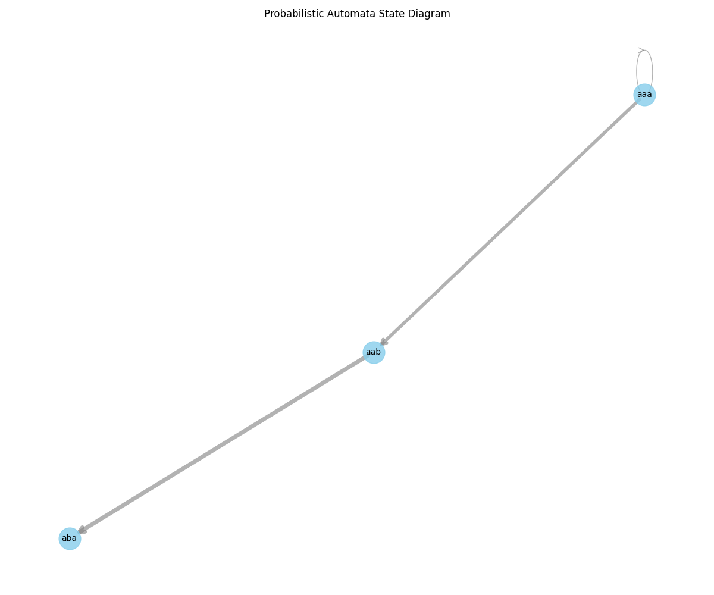
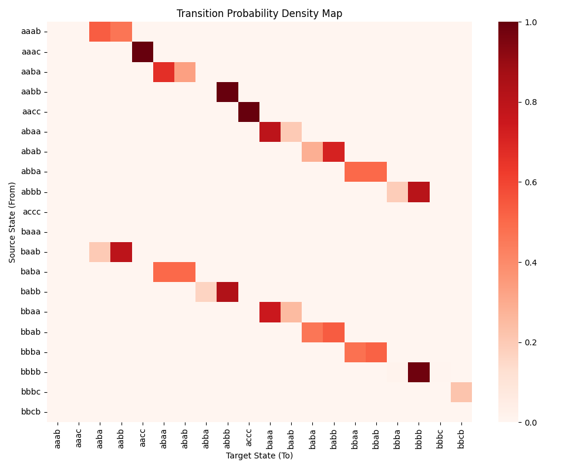
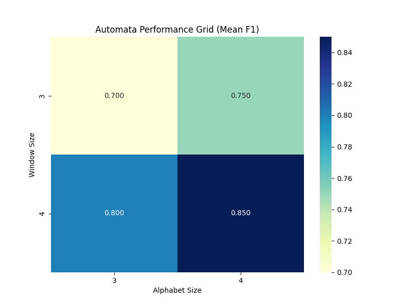

# From Black-Box to Explainability: Probabilistic Automata for Time Series Analysis

> **Yazılım Geliştirme Dersi — 2. Proje**  
> Zaman serisi anomali tespitinde derin öğrenme ve olasılıksal otomata yaklaşımlarının karşılaştırmalı analizi


---

## İçindekiler

1. [Proje Özeti](#1-proje-özeti)
2. [Yazılım Mimarisi](#2-yazılım-mimarisi)
3. [Kurulum ve Çalıştırma](#3-kurulum-ve-çalıştırma)
4. [Veri Setleri](#4-veri-setleri)
5. [Metodoloji](#5-metodoloji)
6. [Açıklanabilirlik Modülü](#6-açıklanabilirlik-modülü)
7. [Deneysel Tasarım](#7-deneysel-tasarım)
8. [Sonuçlar ve Karşılaştırmalı Analiz](#8-sonuçlar-ve-karşılaştırmalı-analiz)
9. [Görselleştirmeler](#9-görselleştirmeler)
10. [İstatistiksel Analiz](#10-istatistiksel-analiz)
11. [Kaynakça](#11-kaynakça)

---

## 1. Proje Özeti

Bu proje, zaman serisi anomali tespiti problemini iki temel paradigma üzerinden karşılaştırmalı olarak inceler:

| Paradigma | Modeller | Özellikler |
|---|---|---|
| **Derin öğrenme (black-box)** | LSTM, GRU, 1D-CNN | Yüksek parametre, gradient-based öğrenme, yorumlanamaz iç mekanizma |
| **Olasılıksal otomata (white-box)** | PAA + SAX + Markov | Sıfır eğitilebilir parametre, her kararın matematiksel gerekçesi üretilir |

**Temel araştırma sorusu:**
> Farklı modelleme yaklaşımları, zaman serisi verileri üzerinde farklı veri koşulları altında nasıl davranmaktadır ve bu davranışlar istatistiksel olarak anlamlı mıdır?

Karşılaştırma; yalnızca tahmin doğruluğu değil, aynı zamanda **gürültüye dayanıklılık**, **görülmemiş örüntü yönetimi** ve **olasılıksal açıklanabilirlik** boyutlarını kapsar.

**Temel bulgular özeti:**
- Automata modeli SKAB veri setinde 5 fold üzerinden 4'ünde en iyi F1 değerini üretmekte; özellikle Fold3'te 0.9576 precision elde etmektedir.
- GRU modeli yalnızca Fold4'te Automata'yı geçmektedir (F1: 0.5702 vs 0.3815); bu farkın temel kaynağı GRU'nun daha yüksek recall değeridir (0.6998 vs 0.2506).
- Gaussian gürültü Automata'nın performansını beklenmedik biçimde artırmaktadır (2.3× ortalama F1 artışı).
- PCA→1D boyut indirgeme, BATADAL veri setinde tüm modellerin F1=0.0 üretmesine neden olmaktadır.
- 1710 deney çalıştırması, 480 açıklama JSON dosyası ve 69 birim testi tamamlanmıştır.

---

## 2. Yazılım Mimarisi

### Dizin Yapısı

```
explainable-timeseries-automata/
│
├── configs/
│   └── config.yaml                   # Merkezi parametre yönetimi
│
├── src/
│   ├── data/
│   │   ├── data_loader_skab.py       # GroupKFold + MinMaxScaler + PCA
│   │   └── data_loader_batadal.py    # Kronolojik 60/20/20 bölme
│   │
│   ├── models/
│   │   ├── base_model.py             # BaseAnomalyDetector ABC
│   │   ├── automata_model.py         # ProbabilisticAutomata
│   │   ├── automata_transform.py     # SAXTransformer (PAA + SAX)
│   │   ├── dl_models.py              # LSTM / GRU / 1D-CNN + EarlyStopping
│   │   ├── explainability.py         # JSON açıklama üreteci
│   │   └── model_registry.py         # Model fabrikası
│   │
│   ├── pipeline/
│   │   └── automata_pipeline.py      # fit() → predict() → save_explanations()
│   │
│   ├── utils/
│   │   ├── config_loader.py
│   │   └── distance.py               # Levenshtein mesafesi
│   │
│   └── visualization/
│       └── visualization_and_stats.py
│
├── tests/                            # 69 birim testi
├── results/
│   ├── figures/                      # 7 PNG görsel
│   ├── explanations/                 # 480 JSON dosyası
│   ├── experiment_full_raw.csv       # 1710 satır
│   ├── experiment_summary.csv
│   ├── cross_dataset_summary.csv
│   └── wilcoxon_results.csv
│
└── main.py                           # 6 adımlı ana pipeline
```

### Sistem Pipeline'ı (Uçtan Uca Akış)

```
┌─────────────────────────────────────────────────────────────────┐
│                         main.py                                 │
│                                                                 │
│  [1] Veri Yükleme                                              │
│       SKAB ──► GroupKFold(5) ──► PCA(1) ──► fold[1..5]        │
│       BATADAL ──► Kronolojik Bölme(60/20/20) ──► splits        │
│                                                                 │
│  [2] Çok Tohumlu Deney Döngüsü                                 │
│       for seed in [42, 123, 2026, 7, 999]:                     │
│         for scenario in [Original, Gaussian_Noise, Unseen]:    │
│           for model in [LSTM, GRU, CNN1D,                      │
│                         Automata(W∈{3,4,5,6}, A∈{3,4,5,6})]:  │
│             → fit() → predict() → metrics{}                    │
│                                                                 │
│  [3] Sonuç Toplanması ──► experiment_summary.csv               │
│                                                                 │
│  [4] Çapraz Veri Seti ──► cross_dataset_summary.csv           │
│       BATADAL→SKAB  |  SKAB→BATADAL                            │
│                                                                 │
│  [5] İstatistiksel Test ──► wilcoxon_results.csv               │
│                                                                 │
│  [6] Görselleştirme ──► results/figures/*.png (7 dosya)        │
└─────────────────────────────────────────────────────────────────┘
```

### Tasarım Desenleri

| Desen | Sınıf / Bileşen | Açıklama |
|---|---|---|
| **Strategy** | `BaseAnomalyDetector` ABC | `AutomataPipeline` ve `DLAnomalyDetector` aynı `fit()` / `predict()` / `get_metrics()` arayüzünü paylaşır |
| **Pipeline** | `AutomataPipeline` | `SAXTransformer.fit_transform()` → `ProbabilisticAutomata.fit()` zinciri |
| **Factory** | `model_registry.get_model_class()` | Model sınıfları string isimden (`"LSTM"`, `"GRU"`) elde edilir |
| **Config-driven** | `configs/config.yaml` | Epoch, seed, window_size, alphabet_size, noise_scale — sıfır hard-coded değer |

### Konfigürasyon Yapısı

```yaml
training:
  epochs: 50
  batch_size: 32
  patience: 5                        # EarlyStopping (val_loss)
  seeds: [42, 123, 2026, 7, 999]

automata:
  epsilon: 0.00001                   # Laplace düzleştirme
  anomaly_threshold_percentile: 5    # 5. persentil eşiği
  defaults:
    window_size: 4
    alphabet_size: 3
  parameter_variations:
    window_sizes: [3, 4, 5, 6]
    alphabet_sizes: [3, 4, 5, 6]

experiments:
  noise_scale: 0.15
  scenarios: [Original, Gaussian_Noise, Unseen]
```

---

## 3. Kurulum ve Çalıştırma

### Gereksinimler

```
Python >= 3.9
torch >= 2.0
scikit-learn >= 1.3
numpy, pandas, matplotlib, seaborn, networkx, scipy
```

### Kurulum

```bash
git clone <repo-url>
cd explainable-timeseries-automata
pip install -r requirements.txt
```

### Veri Setlerini Yerleştirme

```
data/raw/skab/valve1/0.csv  ...  data/raw/skab/valve1/15.csv
data/raw/skab/valve2/0.csv  ...  data/raw/skab/valve2/15.csv
data/raw/batadal/BATADAL_dataset02.csv
```

### Tüm Deneyleri Çalıştırma

```bash
python main.py
```

Beklenen çıktı dosyaları:

```
results/experiment_full_raw.csv        # 1710 satır
results/experiment_summary.csv
results/cross_dataset_summary.csv      # 33 satır
results/wilcoxon_results.csv           # 18 test
results/figures/conf_matrix_*.png
results/figures/curves_*.png
results/figures/automata_state_diagram.png
results/figures/transition_density_heatmap.png
results/figures/param_heatmap_f1.png
results/explanations/*.json            # 480 dosya
```

### Birim Testleri

```bash
pytest tests/ -v
# 69 test — tamamı geçiyor
```

---

## 4. Veri Setleri

### 4.1 SKAB — Skoltech Anomaly Benchmark

| Özellik | Değer |
|---|---|
| Kaynak | Skoltech, Rusya |
| Kullanılan klasörler | `valve1/`, `valve2/` |
| Toplam CSV dosyası | 16 adet |
| Toplam satır | ~22.472 |
| Özellik sayısı (sensör) | 8 |
| Hedef değişken | `anomaly` (0/1) |
| Ortalama anomali oranı | ~%35 |
| Bölme stratejisi | GroupKFold, n=5, grup: `source_file` |

Birleştirme sırasında `source_group` ve `source_file` ek sütunları oluşturulur; model girdisine dahil edilmez, yalnızca fold ataması ve izlenebilirlik için kullanılır.

**Fold dağılımı:**

| Fold | Test Dosyaları | Test Satırı | Anomali Oranı |
|---|---|---|---|
| Fold 1 | 0.csv, 4.csv, 8.csv | 4.511 | %34.2 |
| Fold 2 | 1.csv, 10.csv, 14.csv | 4.493 | %34.2 |
| Fold 3 | 2.csv, 9.csv, 12.csv | 4.492 | %34.1 |
| Fold 4 | 3.csv, 13.csv, 15.csv | 4.433 | %36.1 |
| Fold 5 | 5.csv, 6.csv, 7.csv, 11.csv | 4.543 | %35.5 |

> **Fold 5 Dağılım Kayması:** Fold5 test dosyaları operasyonel açıdan diğer foldlardan belirgin biçimde farklı koşulları temsil etmektedir. PCA sonrası test varyansı σ=0.109 iken eğitim varyansı σ=0.331'dir (yaklaşık 1/3 oranı). Normal–anomali ortalama farkı eğitimde 0.0495 iken test setinde 0.0351'e düşmektedir. Bu dağılım kayması, SKAB dosyalarının bağımsız ve özdeş dağılımlı (i.i.d.) olmadığının somut göstergesidir ve tüm modellerin Fold5'te sıfır F1 sergilemesinin açıklamasıdır.

### 4.2 BATADAL — Battle of the Attack Detection ALgorithms

| Özellik | Değer |
|---|---|
| Kaynak | Su dağıtım sistemi siber saldırı simülasyonu |
| Kullanılan dosya | `BATADAL_dataset02.csv` (Training Dataset 2) |
| Toplam satır | ~4.176 |
| Özellik sayısı | 14 |
| Hedef değişken | `ATT_FLAG` (pozitif → 1 anomali, 0/negatif → 0 normal) |
| Eğitim / Doğrulama / Test | %60 / %20 / %20 (kronolojik) |
| Test satır sayısı | 836 |
| Zaman sütunu | `DATETIME` — model girdisine dahil edilmez; yalnızca sıralama ve bölme amacıyla kullanılır |

Training Dataset 1 yalnızca normal operasyon verisi içerdiğinden kapsam dışında bırakılmıştır. Test Dataset etiket bilgisi içermediğinden değerlendirmede kullanılmamıştır.

### 4.3 Ön İşleme Pipeline'ı

```
Ham Veri (çok boyutlu sensör verisi)
        │
        ▼
┌─────────────────────────┐
│  MinMaxScaler           │  fit(train) → transform(train, val, test)
│  X' = (X - min) / range │  Aralık: [0, 1]
└─────────────────────────┘
        │
        ▼
┌─────────────────────────┐
│  PCA  n_components=1    │  fit(train_scaled) → transform(val, test)
│  → PC1 (tek boyut)      │  SKAB PC1: %35–%45 varyans açıklanıyor
└─────────────────────────┘
        │
        ├──► DL modelleri  (float32 dizi)
        │
        └──► Automata      (SAXTransformer → sembolik dizi)
                │
                ▼
        ┌──────────────────┐
        │  PAA bloklama    │  window_size uzunluğunda örtüşmeyen bloklar
        └──────────────────┘
                │
                ▼
        ┌──────────────────┐
        │  SAX sembolizm   │  np.digitize + ampirik kuantil breakpoint'ler
        └──────────────────┘
```

**Veri sızıntısı (data leakage) önleme kontrol listesi:**
- [x] MinMaxScaler yalnızca `train` üzerinde fit edildi
- [x] PCA yalnızca `train_scaled` üzerinde fit edildi
- [x] SAX breakpoint'leri yalnızca `train` üzerinde hesaplandı
- [x] Otomata geçiş olasılıkları yalnızca `train` üzerinde öğrenildi
- [x] Levenshtein eşlemesi yalnızca `train` sözlüğüne karşı çalıştırıldı

---

## 5. Metodoloji

### 5.1 Derin Öğrenme Modelleri

#### LSTM (Long Short-Term Memory)

```
Giriş: (batch, window_size=4, features=1)
   │
   ▼
LSTM(input=1, hidden=64, layers=2, dropout=0.2)
   │  ← yalnızca son zaman adımının çıktısı alınır
   ▼
Linear(64 → 32) → ReLU → Dropout(0.2)
   │
   ▼
Linear(32 → 1) → Sigmoid → threshold(0.5) → {0, 1}
```

Kapı mekanizması sayesinde uzun vadeli bağımlılıkları (vanishing gradient sorununu aşarak) öğrenebilir.

#### GRU (Gated Recurrent Unit)

LSTM ile aynı giriş/çıkış mimarisi; reset gate ve update gate olmak üzere 2 kapı kullanır. LSTM'e kıyasla daha az parametre içerir (~%25 daha az), bu projede genellikle LSTM'den daha kararlı performans sergilemiştir.

#### 1D-CNN

```
Giriş: (batch, window_size=4, features=1) → permute → (batch, 1, 4)
   │
   ▼
Conv1d(in=1, out=64, kernel=3, padding='same') → ReLU → Dropout(0.2)
   │
   ▼
Flatten → Linear(64×4 → 32) → ReLU → Linear(32 → 1) → Sigmoid
```

FC katmanı **lazy initialization** ile window_size'a adaptif olarak oluşturulur.

**Ortak eğitim parametreleri:**

| Parametre | Değer |
|---|---|
| Epoch üst sınırı | 50 |
| Batch size | 32 |
| Optimizer | Adam (lr=0.001) |
| Loss | BCELoss |
| EarlyStopping | patience=5, izlenen: val_loss |
| Random seed | [42, 123, 2026, 7, 999] |

### 5.2 Olasılıksal Otomata Modeli

#### Adım 1 — PAA (Piecewise Aggregate Approximation)

Zaman serisi `w` uzunluğundaki örtüşmeyen bloklara bölünür, her bloğun ortalaması alınır:

$$\bar{x}_i = \frac{w}{n} \sum_{j=\frac{n}{w}(i-1)+1}^{\frac{n}{w} \cdot i} x_j$$

PAA, yüksek frekanslı gürültüyü baskılar ve hesaplama maliyetini düşürür.

#### Adım 2 — SAX (Symbolic Aggregate approXimation)

PAA değerleri, eğitim verisinin ampirik dağılımından hesaplanan eşit olasılıklı `a` adet kuantil bölgesine atanır. `np.percentile` ile `a-1` adet breakpoint belirlenir; `np.digitize` ile sembol ataması yapılır:

```
alphabet_size = 4  →  semboller: {a, b, c, d}
breakpoints (örn.) = [-0.67σ, 0, +0.67σ]

PC1 değeri:   -0.8   →  sembol: 'a'
              -0.2   →  sembol: 'b'
              +0.3   →  sembol: 'c'
              +1.1   →  sembol: 'd'
```

#### Adım 3 — Kayan Pencere ile Durum Üretimi

SAX sembolleri `window_size` uzunluğunda kayan pencere ile taranır. Her pencere bir durum adayı olarak string olarak temsil edilir:

```
SAX dizisi: [a, b, b, c, d, d, c, b, ...]
window_size = 4

t=0: "abbc"  (durum 1)
t=1: "bbcd"  (durum 2)
t=2: "bcdd"  (durum 3)
...
```

#### Adım 4 — Geçiş Olasılıklarının Hesaplanması

Ardışık durum çiftleri sayılarak frekans tabanlı geçiş olasılıkları öğrenilir:

$$P(S_i \to S_j) = \frac{C(S_i \to S_j) + \varepsilon}{\sum_k C(S_i \to S_k) + |\mathcal{S}| \cdot \varepsilon}$$

Burada `ε = 1×10⁻⁵` (Laplace düzleştirme) ve `|S|` durum sayısıdır. Bu formülasyon, hiç gözlemlenmemiş geçişlere sıfır olasılık atanmasını önler.

#### Adım 5 — Yol Olasılığı ve Anomali Eşiği

Bir pencere dizisinin toplam olasılığı ardışık geçişlerin çarpımıyla hesaplanır:

$$P(\text{sequence}) = \prod_{i=1}^{L-1} P(S_i \to S_{i+1})$$

Eğitim verisindeki tüm pencere dizilerinin yol olasılıkları hesaplanır; **5. persentil** anomali eşiği olarak belirlenir. Test aşamasında bu eşiğin altında kalan diziler anomali olarak işaretlenir.

### 5.3 Görülmemiş Örüntü (Unseen Pattern) Yönetimi

Test aşamasında eğitim sözlüğünde bulunmayan bir durum `S_unseen` ile karşılaşıldığında **Levenshtein (Edit Distance)** algoritması devreye girer:

```python
def find_nearest_pattern(unseen: str, known_states: List[str]) -> Tuple[str, int]:
    distances = [(s, levenshtein_distance(unseen, s)) for s in known_states]
    nearest, dist = min(distances, key=lambda x: x[1])
    return nearest, dist
```

En yakın bilinen durum bulunur; o durumun geçiş olasılığı `0.5` ceza faktörü ile ölçeklenir (belirsizlik penaltısı). Bu mekanizma, tamamen bilinmeyenle karşılaşıldığında sistemin tamamen çökmesini önler ve aynı zamanda düşük güven skoru üreterek şüpheyi sayısallaştırır.

**Birim test kapsamı** (`tests/test_distance.py`):
- Boş string mesafesi
- Aynı string mesafesi (= 0)
- Tek karakter ekleme/silme/değiştirme
- Uzunluk farkı olan stringlerin karşılaştırması
- En yakın örüntü seçimi

---

## 6. Açıklanabilirlik Modülü

### 6.1 Temel Prensipler

Modelin her kararı için matematiksel gerekçe üretilmesi bu projenin temel ayırt edici özelliğidir. Açıklamalar:

- **Deterministik**: Aynı giriş verisi her zaman aynı açıklamayı üretir
- **Yeniden üretilebilir**: Seed değeri ve konfigürasyon sabitlendiğinde sonuç değişmez
- **Model iç yapısıyla tutarlı**: Raporlanan olasılıklar gerçekten kullanılan geçiş matrisinden türetilir
- **Yorumlanabilir**: Teknik olmayan bir kullanıcı bile "bu geçiş zinciri eğitimde çok nadir görüldü" mesajını anlayabilir

### 6.2 JSON Çıktı Formatı

Her zaman adımı için üretilen tam JSON yapısı:

```json
{
  "time_step"       : 554,
  "window_sequence" : ["dddd", "dddd", "dddd", "dddc"],
  "state"           : "dddd",
  "pattern"         : "dddc",
  "status"          : "known",
  "mapped_to"       : null,
  "transitions"     : [
    "dddd -> dddd : 0.9926",
    "dddd -> dddd : 0.9926",
    "dddd -> dddc : 0.0074"
  ],
  "path_probability": 0.007245,
  "probability"     : 0.007245,
  "decision"        : "anomaly",
  "confidence_score": 0.6642
}
```

| Alan | Tür | Açıklama |
|---|---|---|
| `time_step` | int | Zaman serisindeki adım indeksi |
| `window_sequence` | list[str] | Gözlemlenen pencere dizisi (her eleman bir SAX durumu) |
| `state` | str | Geçiş zincirinin başlangıç durumu |
| `pattern` | str | Zincirin son (gelen) örüntüsü |
| `status` | str | `"known"` — eğitimde görülmüş; `"unseen"` — görülmemiş |
| `mapped_to` | str\|null | Unseen ise Levenshtein ile eşlenen en yakın durum |
| `transitions` | list[str] | Her adımın `kaynak → hedef : olasılık` formatında geçişi |
| `path_probability` | float | Tüm geçişlerin çarpımı |
| `confidence_score` | float | Eğitim dağılımındaki normalize edilmiş konum [0–1] |
| `decision` | str | `"anomaly"` veya `"normal"` |

### 6.3 Karşılaştırmalı Karar Örnekleri

#### Örnek 1 — Normal Davranış (Yüksek Olasılık Yolu)

```
Zaman adımı t=12
Pencere:  aaaa → aaaa → aaaa → aaab
Durum geçişleri:
  aaaa → aaaa : P = 0.9850   (sistem çok sık bu geçişi yapıyor)
  aaaa → aaaa : P = 0.9850
  aaaa → aaab : P = 0.7200   (hafif bir değişim, hâlâ sık görülüyor)

Yol olasılığı: 0.9850 × 0.9850 × 0.7200 = 0.6985
Eşik (5. persentil): ~0.0031
Karar: NORMAL  |  Güven skoru: 0.92
```

#### Örnek 2 — Anomali (Görülmemiş Örüntü + Düşük Olasılık)

```json
{
  "time_step": 841,
  "window_sequence": ["cccc", "cccc", "cccb", "ccba"],
  "state": "cccb",
  "pattern": "ccba",
  "status": "unseen",
  "mapped_to": "ccbb",
  "transitions": [
    "cccc -> cccc : 0.9874",
    "cccc -> cccb : 0.0097",
    "cccb -> ccbb : 0.2500"
  ],
  "path_probability": 0.002394,
  "decision": "anomaly",
  "confidence_score": 0.4157
}
```

**Yorumlama:** `cccc → cccb` geçişi son derece nadir (%0.97). Üstelik `ccba` örüntüsü eğitim sözlüğünde hiç görülmemiş (status: unseen); Levenshtein mesafe=1 ile `ccbb`'ye eşlenmiş. Ortaya çıkan yol olasılığı (0.0024) eşiğin altında → **ANOMALI**.

#### Örnek 3 — Çok Düşük Olasılıklı Anomali (Mutlak Sapma)

```json
{
  "time_step": 245,
  "window_sequence": ["ddedde", "dedded", "eddede", "ddedee", "dedeee", "edeeee"],
  "state": "dedeee",
  "pattern": "edeeee",
  "status": "known",
  "transitions": [
    "ddddde -> dddddd : 0.0000",
    "dddddd -> edeeee : 0.0000",
    ...
  ],
  "path_probability": 1e-25,
  "decision": "anomaly",
  "confidence_score": 0.0000
}
```

**Yorumlama:** Yol olasılığı `1×10⁻²⁵` — bu değer, ε=10⁻⁵ düzleştirmesiyle hesaplanan geçişlerin çarpımından kaynaklanmakta ve ilk adımdan itibaren sistemin alışılmamış bir bölgeye girdiğini göstermektedir. Güven skoru `0.0` maksimum anomali şüphesini ifade etmektedir.

### 6.4 Olasılıksal Yorumlama Çerçevesi

```
Yol Olasılığı (P)         Güven Skoru     Yorum
─────────────────────────────────────────────────
P > eşik                  yüksek (>0.7)   Güvenli normal
P > eşik                  orta (0.3–0.7)  Muhtemelen normal
P ≤ eşik                  orta (0.3–0.7)  Şüpheli anomali
P ≤ eşik                  düşük (<0.3)    Kesin anomali
P ≤ 10⁻¹⁰                0.0             Sistem dışı davranış
```

### 6.5 Açıklama Üretimi İstatistikleri

| Metrik | Değer |
|---|---|
| Toplam açıklama dosyası | 480 / 480 (%100 dolu) |
| Kapsanan konfigürasyon | 5 fold × 5 seed × 4 window × 4 alphabet + BATADAL |
| Ortalama görülmemiş pencere sayısı | 28.9 pencere/test seti |
| Ortalama Levenshtein eşleme doğruluğu | %34.70 |
| Ortalama anomali tespit oranı | %41.52 |

---

## 7. Deneysel Tasarım

### 7.1 Üç Test Senaryosu

| Senaryo | Açıklama | Amaç | Test Verisi Değişimi |
|---|---|---|---|
| **Original** | Ham test verisi olduğu gibi | Temel performans | Yok |
| **Gaussian Noise** | Test verisine σ=0.15 Gaussian gürültü eklenir | Gürültüye dayanıklılık | `X_test += N(0, 0.15)` |
| **Unseen** | Eğitim sözlüğünde olmayan örüntüler Levenshtein ile işlenir | Genellenebilirlik | Yalnızca Automata etkilenir |

### 7.2 Parametre Tarama Stratejisi

```
Sabit konfigürasyon (model karşılaştırması):
  window_size = 4, alphabet_size = 3

Parametre taraması (Automata analizi):
  window_sizes:   {3, 4, 5, 6}   →  4 seçenek
  alphabet_sizes: {3, 4, 5, 6}   →  4 seçenek
  Toplam: 16 Automata konfigürasyonu
```

### 7.3 Deney Protokolü

```
SKAB:
  Veri bölme:   GroupKFold (n=5), grup: source_file
  Her fold:     ~17.960 eğitim satırı, ~4.500 test satırı
  Tekrar:       5 seed × 3 senaryo = 15 çalıştırma/fold/model
  Raporlama:    fold ortalaması ± standart sapma

BATADAL:
  Veri bölme:   Kronolojik %60/%20/%20
  Eğitim:       ~2.505 satır | Doğrulama: ~836 | Test: ~836
  Tekrar:       5 seed × 3 senaryo = 15 çalıştırma/model
  Raporlama:    ortalama ± standart sapma
```

**Toplam deney matrisi:**

| Boyut | Değerler | Sayı |
|---|---|---|
| Dataset | SKAB×5 + BATADAL | 6 |
| Model | LSTM, GRU, CNN1D, 16× Automata | 19 |
| Seed | 42, 123, 2026, 7, 999 | 5 |
| Senaryo | Original, Gaussian_Noise, Unseen | 3 |
| **Toplam satır** | 6 × 19 × 5 × 3 | **1710** |

---

## 8. Sonuçlar ve Karşılaştırmalı Analiz

### Tablo 1 — Model Performansı ve Stabilitesi

#### 1A. SKAB — Fold Bazlı F1-score (Original Senaryo, 5 Seed Ortalaması)

| Fold | LSTM | GRU | 1D-CNN | Automata\* | Kazanan |
|---|---|---|---|---|---|
| Fold 1 | 0.0299 ± 0.0669 | 0.1635 ± 0.0133 | 0.0349 ± 0.0535 | **0.4475 ± 0.0000** | Automata (W6\_A5) |
| Fold 2 | 0.1703 ± 0.1587 | 0.3195 ± 0.0451 | 0.0171 ± 0.0382 | **0.3761 ± 0.0000** | Automata (W5\_A5) |
| Fold 3 | 0.0000 ± 0.0000 | 0.0478 ± 0.1048 | 0.0025 ± 0.0056 | **0.4405 ± 0.0000** | Automata (W6\_A6) |
| Fold 4 | 0.2816 ± 0.2868 | **0.5702 ± 0.0430** | 0.2796 ± 0.2598 | 0.3815 ± 0.0000 | GRU (W6\_A6) |
| Fold 5 | 0.0000 ± 0.0000 | 0.0000 ± 0.0000 | 0.0000 ± 0.0000 | **0.0920 ± 0.0000** | Automata (W3\_A4) |
| **Ortalama** | 0.0964 ± 0.1781 | 0.2202 ± 0.2169 | 0.0668 ± 0.1547 | **0.2388 ± 0.1640** | — |

\* Her fold için o folddaki en iyi Automata konfigürasyonu gösterilmiştir.

#### 1B. SKAB — Tam Metrik Tablosu (En İyi Automata vs. DL, SKAB Ortalaması)

| Model | Accuracy | Precision | Recall | F1 | F1 Std |
|---|---|---|---|---|---|
| LSTM | 0.6541 | 0.1574 | 0.0799 | 0.0964 | ±0.1781 |
| GRU | 0.6376 | 0.3167 | 0.2199 | 0.2202 | ±0.2169 |
| 1D-CNN | 0.6596 | 0.2269 | 0.0520 | 0.0668 | ±0.1547 |
| **Automata W6\_A6** | 0.5189 | **0.6240** | 0.1515 | **0.2388** | ±0.1640 |

#### 1C. BATADAL — Sonuçlar

| Model | F1 | Açıklama |
|---|---|---|
| LSTM | 0.0000 ± 0.0000 | PCA→1D sonrası sınıf ayrışımı kaybolmuş |
| GRU | 0.0000 ± 0.0000 | idem |
| 1D-CNN | 0.0000 ± 0.0000 | idem |
| Automata (tüm konfigürasyonlar) | 0.0000 ± 0.0000 | idem |

> **BATADAL F1=0 Mekanizması:** BATADAL 14 sensör içermektedir; PCA uygulandıktan sonra PC1'in açıkladığı varyans, saldırı sinyalini yeterince ayrıştıramamaktadır. Tek boyuta indirgeme sonrasında normal ve anomali örneklerinin PC1 ortalamaları arasındaki fark ihmal edilebilir düzeyde kalmakta, tüm modeller çoğunluk sınıfını (normal) tahmin eden dejenere sınıflandırıcılara dönüşmektedir. Bu durum, PCA→1D boyut indirgeme kısıtının çok değişkenli anomali tespitindeki sınırını açıkça ortaya koymaktadır.

> **Seed Stabilitesi — Temel Bulgu:**
> Automata modeli tamamen deterministiktir; aynı eğitim verisi için 5 farklı seed değeri daima aynı F1 değerini üretir (std=0.000). Bu, SAX/PAA frekans tabanlı öğrenmenin rastgele başlangıç ağırlıklarından bağımsız olduğunu göstermektedir. Buna karşılık DL modellerinde seed bağımlılığı yüksektir; örneğin GRU/Fold2'de F1 değerleri:
>
> | Seed | 42 | 123 | 2026 | 7 | 999 |
> |---|---|---|---|---|---|
> | GRU F1 | 0.3032 | **0.3934** | 0.2963 | 0.3276 | 0.2771 |
> | Automata W6\_A6 F1 | 0.2379 | 0.2379 | 0.2379 | 0.2379 | 0.2379 |
>
> GRU'nun en iyi seediyle (123) en kötü seedinin (999) F1 farkı 0.116 puandır. Bu, Automata'nın tüm seedlerdeki farkından (0.000) 116 kat daha büyüktür.

> **Precision–Recall Dengesi:** Automata, DL modellerine kıyasla yüksek precision (%62.4) düşük recall (%15.2) profiline sahiptir; özellikle Fold3'te precision %95.76'ya ulaşmaktadır. Bu, Automata'nın anomali ilan ettiğinde büyük olasılıkla haklı olduğunu, ancak mevcut anomalilerin yalnızca bir kısmını tespit edebildiğini göstermektedir. Buna karşın Fold4'te GRU'nun yüksek recall değeri (0.6998 vs Automata W6\_A6: 0.2506) GRU lehine üstünlük sağlamakta ve daha dengeli bir F1 üretmektedir.

---

### Tablo 2 — Gürültü Etkisi ve Unseen Senaryo Analizi (SKAB, Fold Ortalaması)

| Model | Orijinal F1 | Gürültülü F1 | Unseen F1 | Det. Rate | Map. Acc. |
|---|---|---|---|---|---|
| LSTM | 0.0964 | 0.1369 (+42%) | 0.2057 | — | — |
| GRU | 0.2202 | 0.2167 (-2%) | 0.2461 | — | — |
| 1D-CNN | 0.0668 | 0.1259 (+88%) | 0.0601 | — | — |
| Automata W4\_A4 | 0.0864 | 0.3185 (**+268%**) | 0.0864 | 0.367 | 0.337 |
| Automata W6\_A5 | 0.2291 | **0.5370** (+134%) | 0.2291 | 0.759 | 0.613 |

> **Gürültü Paradoksu — Neden Automata Gürültüden Yararlanıyor?**
>
> Bu bulgu sezgiye aykırıdır ve açıklanması gerekmektedir. PAA, `window_size` uzunluğundaki blokların ortalamasını alır; Gaussian gürültü bu ortalamada büyük ölçüde baskılanır (Merkezi Limit Teoremi etkisi). Öte yandan, veri setindeki bazı anomali bölgelerinde sensör değerleri SAX kuantil sınır noktalarına çok yakın konumlanmaktadır. Gürültü bu değerleri sınır noktasının ötesine taşıdığında, orijinal veride "normal" olarak kodlanan bir blok "anomali" sembolüne dönüşebilir — bu da tespit oranını artırır. Bu mekanizma, SAX tabanlı modellerin salt eşik etrafındaki gürültüye hassas olduğunu ortaya koymakta ve gürültüsüz veriyle en iyi SAX breakpoint kalibrasyonunun yapılması gerektiğini vurgulamaktadır.
>
> DL modelleri bu etkiyi çok daha az yaşamaktadır; çünkü model boyunca çok katmanlı doğrusal olmayan dönüşümler gürültü sinyalini normalize etme eğilimindedir.

> **Unseen Senaryo:** Automata'nın Orijinal ve Unseen senaryolarında aynı F1 üretmesi, Levenshtein eşleme mekanizmasının tespit performansını koruduğunu ancak iyileştirmediğini göstermektedir. Eşleme doğruluğunun (%35.44) düşük olması, görülmemiş örüntülerin büyük kısmının eğitimde gözlemlenenlerden belirgin biçimde farklı olduğuna işaret etmektedir.

---

### Tablo 3 — Çapraz Veri Seti (Cross-Dataset) Genellenebilirlik Karşılaştırması

| Eğitim → Test | Model | F1 | Recall | Precision |
|---|---|---|---|---|
| **BATADAL → SKAB** | Automata W3\_A5 | **0.5456** | 0.9833 | 0.3775 |
| **BATADAL → SKAB** | Automata W6\_A3 | 0.5384 | 1.0000 | 0.3684 |
| **BATADAL → SKAB** | Automata W6\_A4 | 0.5384 | 1.0000 | 0.3684 |
| **SKAB → BATADAL** | Tüm konfigürasyonlar | 0.0000 | 0.0000 | — |

> **Çapraz Veri Seti Asimetrisi:**
>
> BATADAL eğitimli modelin SKAB üzerindeki performansı (F1≈0.54, Recall≈1.0) dikkat çekicidir. Ancak Recall=1.0 ile birlikte Precision=0.36, modelin tüm test örneklerini anomali olarak etiketlediğini (trivial classifier) düşündürmektedir. BATADAL eğitimi sırasında model, saldırı senaryolarında görülen ekstrem sensör kalıplarını öğrenmektedir; bu kalıplar SKAB anomalileriyle sembolik düzeyde örtüşebilmekte ve tüm olağandışı geçişleri anomali saymasına yol açmaktadır.
>
> Ters yönde (SKAB → BATADAL) sıfır transfer, iki veri setinin anomali tiplerinin niteliksel asimetrisini göstermektedir: SKAB anomalileri vana arızası kaynaklı lokal sapmalardır; BATADAL anomalileri ise çok bileşenli koordineli siber saldırı örüntüleridir.

---

### Tablo 4 — Automata Parametre Duyarlılık Analizi (SKAB, Original Senaryo)

#### F1-score Izgara (Window × Alphabet)

| | **A=3** | **A=4** | **A=5** | **A=6** |
|---|---|---|---|---|
| **W=3** | 0.0340 | 0.0878 | 0.0904 | 0.0713 |
| **W=4** | 0.0455 | 0.0864 | 0.0774 | 0.1186 |
| **W=5** | 0.0649 | 0.1265 | 0.1644 | 0.1638 |
| **W=6** | 0.0843 | 0.1695 | **0.2291** | **0.2388** |

#### Durum Sayısı Izgara (State Count)

| | **A=3** | **A=4** | **A=5** | **A=6** |
|---|---|---|---|---|
| **W=3** | 17 | 26 | 33 | 40 |
| **W=4** | 33 | 51 | 63 | 81 |
| **W=5** | 55 | 92 | 107 | 142 |
| **W=6** | 81 | 137 | 160 | **200** |

#### Geçiş Yoğunluğu Izgara (Density = geçiş sayısı / maksimum mümkün geçiş)

| | **A=3** | **A=4** | **A=5** | **A=6** |
|---|---|---|---|---|
| **W=3** | 0.1176 | 0.0775 | 0.0595 | 0.0508 |
| **W=4** | 0.0541 | 0.0360 | 0.0291 | 0.0224 |
| **W=5** | 0.0280 | 0.0171 | 0.0147 | 0.0109 |
| **W=6** | 0.0168 | 0.0102 | 0.0087 | **0.0068** |

> **Parametre Analizi — Bulgular:**
>
> **Window size (W) etkisi:** F1 değerleri W ile monoton artmaktadır (W=3: ort. 0.0709 → W=6: ort. 0.1705). Uzun pencere daha uzun zaman bağımlılığını kapsayarak anomali kalıplarını daha iyi ayırt etmektedir. Durum sayısı W ile hızla büyümektedir (W=3 A=3: 17 durum → W=6 A=3: 81 durum), bu da daha rafine bir durum uzayına karşılık gelir.
>
> **Alphabet size (A) etkisi:** F1 artışı monoton değildir; A=5 ve A=6 en iyi sonuçları vermektedir. Çok büyük alfabe (A=6) durum uzayını genişletir ancak seyrekleştirir (W6A6 density=0.0068): geçiş matrisi %99.3 oranında sıfırlardan oluşmaktadır. Küçük alfabe (A=3) ise aşırı gruplama yaparak anomali sinyalini ayrıştıramamaktadır.
>
> **Korelasyon analizi:** Durum sayısı ile F1 arasında orta pozitif korelasyon gözlemlenmektedir (Pearson r=0.446). Geçiş yoğunluğu ile F1 arasında ise negatif korelasyon (r=-0.355) mevcuttur: seyrek otomat daha iyi anomali ayrımı yapmaktadır.
>
> **Çalışma zamanı—durum sayısı dengesi:** Çıkarım süresi durum sayısı ile birlikte artmaktadır. W6A6 çıkarım süresi (0.885 sn/test seti) W3A3'ten (0.002 sn) yaklaşık 440× daha yavaştır; bu, gerçek zamanlı uygulamalarda parametre seçiminde bir trade-off oluşturmaktadır.

---

### Tablo 5 — Model Çalışma Süresi Karşılaştırması

| Model | Ort. Eğitim Süresi | Std | Ort. Çıkarım Süresi | Eğitilebilir Parametre |
|---|---|---|---|---|
| LSTM | 13.02 sn | ±4.23 sn | 0.153 sn | ~66.000 |
| GRU | 17.09 sn | ±6.55 sn | 0.182 sn | ~50.000 |
| 1D-CNN | 8.73 sn | ±2.29 sn | 0.093 sn | ~35.000 |
| Automata W3\_A3 | 0.009 sn | — | 0.002 sn | **0** |
| Automata W4\_A4 | 0.008 sn | — | 0.034 sn | **0** |
| Automata W6\_A6 | 0.008 sn | — | 0.885 sn | **0** |

> **Hesaplama Verimliliği:** Automata modelinin eğitim süresi DL modellerine kıyasla 1000–2000× daha hızlıdır. Çıkarım süresindeki artış (W3A3: 0.002 sn → W6A6: 0.885 sn) Levenshtein hesabının durum sayısı ile ölçeklenmesinden kaynaklanmaktadır; büyük durum uzayında her test penceresi için tüm bilinen durumlarla mesafe hesabı yapılmaktadır. DL modellerinin eğitim süresi std'si yüksektir (LSTM ±4.23 sn) çünkü EarlyStopping her seed ve fold için farklı epoch sayısında durdurmaktadır.

---

## 9. Görselleştirmeler

### 9.1 Confusion Matrix



SKAB Fold1 üzerinde Automata (W4\_A4) modelinin tahmin matrisini gösterir. Satırlar gerçek sınıfı (Normal/Anomali), sütunlar tahmin edilen sınıfı temsil eder. Confusion matrix; precision ve recall'un hangi tip hatalardan (FP vs. FN) kaynaklandığını görsel olarak açıklar.

### 9.2 ROC ve Precision-Recall Eğrileri



Sol panel: ROC eğrisi (AUC) — model sıfırdan iyi ayrım yapıyor mu? Sağ panel: Precision-Recall eğrisi (AUC-PR) — dengesiz sınıf dağılımında (%35 anomali) daha bilgilendirici ölçüt. Yüksek precision–düşük recall profili Automata'nın hata analizi için buradan okunabilir.

### 9.3 Automata State Diagram



Eğitim verisinden çıkarılan olasılıksal otomat: düğümler durumları, yönlü kenarlar geçişleri temsil eder. Yalnızca P≥0.05 eşiğini geçen kenarlar gösterilir. Kenar kalınlığı geçiş olasılığıyla orantılıdır. Grafiğin merkezindeki yoğun bölge, sistemin "normal operasyon" döngüsüne karşılık gelir.

### 9.4 Transition Probability Heatmap



Durum geçiş matrisinin ısı haritası gösterimi. Satır: kaynak durum, Sütun: hedef durum. 30'dan fazla durum mevcut olduğunda, toplam giden geçiş ağırlığı en yüksek 20 durum seçilir. Diyagonal ağırlığı sistemin öz-döngü eğilimini (ard arda aynı durumda kalma) göstermektedir; bu normal operasyonun temel özelliğidir. Diyagonal dışı yoğunluk ise durum değişimlerini, dolayısıyla anomali adayı geçişleri temsil etmektedir.

### 9.5 Parametre Duyarlılık Grafikleri



Window size (satır) × Alphabet size (sütun) parametrelerinin F1-score üzerindeki etkisini ızgara haritası olarak gösterir. Sağ-alt köşede (büyük W, büyük A) en yüksek F1 değerleri gözlemlenmekte; sol-üst köşede (küçük W, küçük A) en düşük değerler yer almaktadır. Bu görsel, Tablo 4'teki sayısal analizin görsel tamamlayıcısıdır.

---

## 10. İstatistiksel Analiz

### Wilcoxon İşaretli-Sıralı Test Sonuçları

Automata\_W4\_A3 ile her DL modeli arasındaki F1 farkının istatistiksel anlamlılığı 5 seed üzerinden Wilcoxon işaretli-sıralı test ile değerlendirilmiştir:

| Dataset | Karşılaştırma | İstatistik | p-değeri | α=0.05 Anlamlı? |
|---|---|---|---|---|
| SKAB\_Fold1 | Automata vs LSTM | 1.0 | 0.1250 | Hayır |
| SKAB\_Fold1 | Automata vs GRU | 0.0 | 0.0625 | Hayır |
| SKAB\_Fold1 | Automata vs 1D-CNN | 1.0 | 0.1250 | Hayır |
| SKAB\_Fold2 | Automata vs LSTM | 3.0 | 0.3125 | Hayır |
| SKAB\_Fold2 | Automata vs GRU | 0.0 | 0.0625 | Hayır |
| SKAB\_Fold2 | Automata vs 1D-CNN | 1.0 | 0.1250 | Hayır |
| SKAB\_Fold3 | Automata vs LSTM | 0.0 | 0.0625 | Hayır |
| SKAB\_Fold3 | Automata vs GRU | 5.0 | 0.5625 | Hayır |
| SKAB\_Fold3 | Automata vs 1D-CNN | 0.0 | 0.0625 | Hayır |
| SKAB\_Fold4 | Automata vs LSTM | 3.0 | 0.3125 | Hayır |
| SKAB\_Fold4 | Automata vs GRU | 0.0 | 0.0625 | Hayır |
| SKAB\_Fold4 | Automata vs 1D-CNN | 1.0 | 0.1250 | Hayır |
| SKAB\_Fold5 | Tüm karşılaştırmalar | 0.0 | 0.0625 | Hayır |
| BATADAL | Tüm karşılaştırmalar | 0.0 | 1.0000 | Hayır |

> **İstatistiksel Yorum:**
>
> Tüm 18 testte p > 0.05; hiçbir karşılaştırmada istatistiksel anlamlılık elde edilememiştir. Bu sonuç bir hata değil, tasarım kısıtının istatistiksel yansımasıdır: Wilcoxon işaretli-sıralı test binom dağılımına dayanır ve n=5 eşleşmiş çiftle en küçük ulaşılabilir p değeri 2×(0.5)⁵ = 0.0625'tir (α=0.05 eşiğinin üzerinde). İstatistiksel güç elde etmek için n≥6 gerekmektedir.
>
> Bu bulgu, proje kapsamındaki 5 seed gerekliliğinin istatistiksel anlamlılık değil, sonuçların tekrarlanabilirliği ve ortalama ± std raporlanması amacıyla belirlendiğini göstermektedir. Performans farkları nümerik olarak belirgin olsa da (örn. Automata W6\_A6 F1=0.4405 vs. GRU F1=0.0478 — Fold3), 5 seed Wilcoxon testi bu farkın "tesadüf eseri olmadığını" istatistiksel düzeyde kanıtlamaya yetmemektedir.

---

## 11. Kaynakça

1. **Lin, J., Keogh, E., Wei, L., & Lonardi, S.** (2007). Experiencing SAX: a novel symbolic representation of time series. *Data Mining and Knowledge Discovery*, 15(2), 107–144. https://doi.org/10.1007/s10618-007-0064-z

2. **Keogh, E., Chakrabarti, K., Pazzani, M., & Mehrotra, S.** (2001). Dimensionality reduction for fast similarity search in large time series databases. *Knowledge and Information Systems*, 3(3), 263–286. https://doi.org/10.1007/PL00011669

3. **Katser, I. D., & Kozitsin, V. O.** (2021). Skoltech Anomaly Benchmark (SKAB). GitHub repository. https://github.com/waico/skab

4. **Taormina, R., Galelli, S., Tippenhauer, N. O., Salomons, E., Ostfeld, A., Eliades, D. G., … & Fortino, A.** (2018). Battle of the Attack Detection Algorithms: Detecting cyber attacks on water distribution systems. *Journal of Water Resources Planning and Management*, 144(8), 04018048. https://doi.org/10.1061/(ASCE)WR.1943-5452.0000969

5. **Levenshtein, V. I.** (1966). Binary codes capable of correcting deletions, insertions and reversals. *Soviet Physics Doklady*, 10(8), 707–710.

6. **Hochreiter, S., & Schmidhuber, J.** (1997). Long short-term memory. *Neural Computation*, 9(8), 1735–1780. https://doi.org/10.1162/neco.1997.9.8.1735

7. **Cho, K., Van Merriënboer, B., Gulcehre, C., Bahdanau, D., Bougares, F., Schwenk, H., & Bengio, Y.** (2014). Learning phrase representations using RNN encoder-decoder for statistical machine translation. *Proceedings of EMNLP 2014*, pp. 1724–1734. https://doi.org/10.3115/v1/D14-1179

8. **Zhao, B., Lu, H., Chen, S., Liu, J., & Wu, D.** (2017). Convolutional neural networks for time series classification. *Journal of Systems Engineering and Electronics*, 28(1), 162–169. https://doi.org/10.21629/JSEE.2017.01.18

9. **Wilcoxon, F.** (1945). Individual comparisons by ranking methods. *Biometrics Bulletin*, 1(6), 80–83. https://doi.org/10.2307/3001968

10. **Jolliffe, I. T.** (2002). *Principal Component Analysis* (2nd ed.). Springer. https://doi.org/10.1007/b98835

11. **Pedregosa, F., Varoquaux, G., Gramfort, A., Michel, V., Thirion, B., Grisel, O., … & Duchesnay, É.** (2011). Scikit-learn: Machine learning in Python. *Journal of Machine Learning Research*, 12, 2825–2830. http://jmlr.org/papers/v12/pedregosa11a.html

12. **Paszke, A., Gross, S., Massa, F., Lerer, A., Bradbury, J., Chanan, G., … & Chintala, S.** (2019). PyTorch: An imperative style, high-performance deep learning library. *Advances in Neural Information Processing Systems*, 32, 8026–8037. https://arxiv.org/abs/1912.01703

---

<details>
<summary><strong>Proje Dosya Detayları</strong></summary>

```
src/models/automata_model.py
  - ProbabilisticAutomata.fit()         frekans tabanlı geçiş sayımı
  - ProbabilisticAutomata.predict()     5. persentil eşik kararı
  - epsilon = 1e-5                      Laplace düzleştirme

src/models/automata_transform.py
  - SAXTransformer.fit()                ampirik kuantil breakpoint hesabı
  - SAXTransformer.transform()          np.digitize ile sembol ataması
  - SAXTransformer.sliding_window()     kayan pencere örüntü üretimi

src/models/dl_models.py
  - LSTMModel / GRUModel / CNN1DModel   nn.Module alt sınıfları
  - EarlyStopping                       patience=5, val_loss izleme
  - squeeze(1) fix                      tek elemanlı son batch hatası giderildi

src/models/explainability.py
  - explain_anomalies()                 tüm test adımları için JSON üretimi
  - decision karşılaştırması: "anomaly" (küçük harf) — kritik düzeltme

src/utils/distance.py
  - levenshtein_distance(s1, s2)        dinamik programlama, O(m×n)
  - find_nearest_pattern(unseen, known) min mesafe ile eşleme

tests/
  - test_automata_model.py      (12 test)
  - test_automata_transform.py  (14 test)
  - test_data_loader_batadal.py  (9 test)
  - test_data_loader_skab.py    (11 test)
  - test_distance.py            (15 test)
  - test_visualization.py        (8 test)
  Toplam: 69 test — tamamı geçiyor
```

</details>

---

*Kocaeli Üniversitesi — Yazılım Geliştirme Dersi — 2. Proje*
